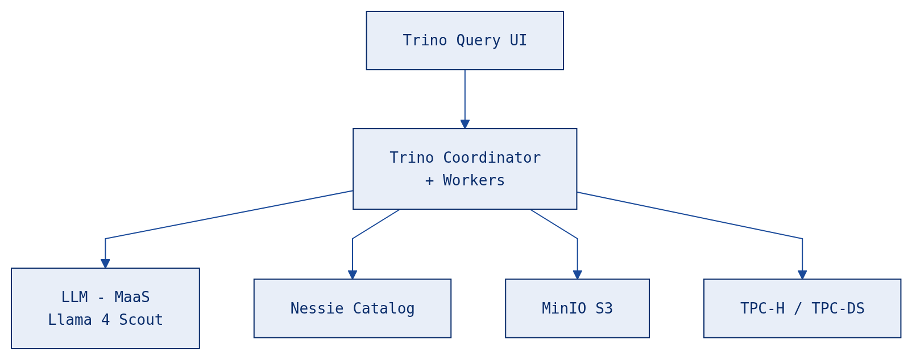

# trino-chart

Trino Helm chart configured for OpenShift with GenAI functions and an Iceberg lakehouse on MinIO S3.

- https://trino.io/docs/current/functions/ai.html

## Architecture



## What's Included

- **Trino** (v480) — distributed SQL query engine, OpenShift SCC-compatible
- **AI Functions** — sentiment analysis, classification, extraction, translation, masking, grammar correction, and text generation via an OpenAI-compatible LLM endpoint
- **Iceberg Lakehouse** — S3-backed tables on MinIO with Nessie catalog
- **Trino Query UI** — web-based SQL editor with syntax highlighting
- **34 example queries** covering all 7 AI functions, including 8 that query real HuggingFace datasets (hotel reviews + financial news) from S3

## OpenShift fastpath install

Install in OpenShift using the all-in-one install script.

```bash
export OPENAI_API_KEY=sk-...                      # model api key
export OPENAI_BASE_URL=                           # model base url. do *not* end with /v1
export OPENAI_MODEL=                              # model name
export S3_ACCESS_KEY=                             # s3 key
export S3_SECRET_KEY=                             # s3 secret
export S3_BUCKET=warehouse                        # bucket name
export HF_TOKEN=hf-...                            # hugging face token for dataset download
export TRINO_NAMESPACE=                           # namespace for trino
export MINIO_NAMESPACE=                           # namespace for minio
export MINIO_PVC_SIZE=                            # minio pvc size e.g. 50Gi
```

```bash
./install.sh
```

## Quick Start

See [SETUP.md](SETUP.md) for the full step-by-step guide. In a bit more detail.

```bash
# Deploy Trino
helm install trino ./trino -n trino --create-namespace

# Deploy Nessie catalog + create MinIO bucket
oc apply -f nessie/ -n trino

# Run the trino port-forward
oc -n trino port-forward svc/trino 8080:8080 2>&1 > /dev/null &

# Load HuggingFace datasets
python examples/load_dataset.py
python examples/load_financial_sentiment.py

# Run all AI function examples
./examples/run_all.sh
```

## Examples

| # | Example | AI Functions Used |
|---|---------|-------------------|
| 01-03 | Sentiment analysis (insider threats, phishing, support) | `ai_analyze_sentiment` |
| 04-07 | Classification (firewall, phishing, SIEM, web requests) | `ai_classify` |
| 08-10 | Data extraction (auth logs, FIM, process logs) | `ai_extract` |
| 11-12 | Grammar correction (firewall, IDS alerts) | `ai_fix_grammar` |
| 13-14 | Text generation (threat report, anomaly explanation) | `ai_gen` |
| 15-16 | PII masking (login events, firewall logs) | `ai_mask` |
| 17-18 | Translation (Japanese, Spanish security logs) | `ai_translate` |
| 19 | Review intelligence pipeline (S3 data) | `ai_analyze_sentiment` + `ai_classify` + `ai_extract` |
| 20 | Executive summary from reviews (S3 data) | `ai_gen` |
| 21 | PII-safe multilingual export (S3 data) | `ai_mask` + `ai_fix_grammar` + `ai_translate` |
| 22 | Market mood ring — AI vs human labels (S3 data) | `ai_analyze_sentiment` + `ai_gen` |
| 23 | Financial threat intelligence (S3 data) | `ai_classify` + `ai_extract` + `ai_mask` |
| 24 | Multilingual trading desk (S3 data) | `ai_translate` + `ai_analyze_sentiment` |
| 25 | AI editorial pipeline (S3 data) | `ai_fix_grammar` + `ai_gen` + `ai_classify` |
| 26 | Daily analyst briefing (S3 data) | `ai_gen` |
| 27 | Semantic reading list (vector search) | Cosine similarity + `ai_gen` |
| 28 | Topic discovery (vector search) | `ai_classify` |
| 29 | Content quality audit (vector search) | `ai_analyze_sentiment` + `ai_fix_grammar` + `ai_classify` |
| 30 | Knowledge graph (vector search) | Cosine similarity + `ai_extract` |
| 31 | Multilingual knowledge base (vector search) | Cosine similarity + `ai_translate` |
| 32 | News-to-Docs cross-catalog (S3 + PostgreSQL) | `ai_classify` + `ai_gen` |
| 33 | Reviews-to-Architecture cross-catalog (S3 + PostgreSQL) | `ai_classify` + `ai_gen` |
| 34 | Federated intelligence briefing (S3 + PostgreSQL) | `ai_gen` |

## Project Structure

```
trino-chart/
├── trino/              # Helm chart
├── nessie/             # Nessie catalog server manifests
├── examples/           # SQL examples + loader script + test runner
├── SETUP.md            # Full setup guide
└── README.md
```

## Notes and Links

The trino chart was extracted and modified to run with OpenShift's more secure defaults.

```bash
helm pull trino/trino --version 1.42.2 --untar
```

See:

- https://trino.io/docs/current/installation/kubernetes.html

The original trino examples were from this medium post:

- https://levelup.gitconnected.com/trino-471-when-sql-meets-ai-and-s3-gets-easier-0ce690334b34
